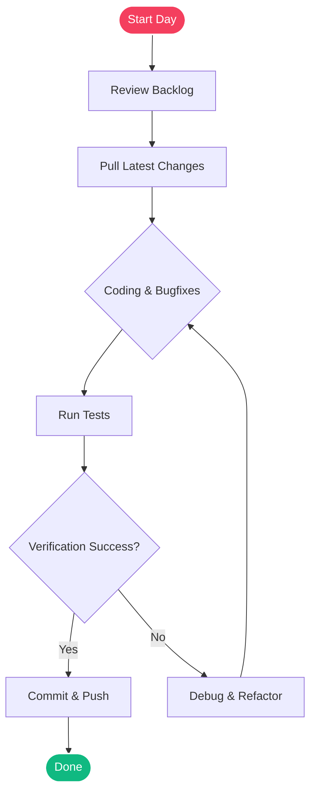

# Daily Project Log

> **Date:** July 6, 2026  
> **Project:** Personal HQ App  
> **Status:** [Active]  
> **Focus:** Layout Redesign & Drawing Canvas  

---

## 🎯 Daily Objectives
*   [x] Fix dark theme readability issues in the Journal module.
*   [ ] Refactor whiteboard canvas to support element grounding and locking.
*   [ ] Enhance all modal popup containers to have proper vertical and horizontal aspect ratios.

---

## ⏱️ Activity Log

### 🌅 Morning Session (09:00 - 12:30)
- Analyzed theme variables in the stylesheet.
- Identified the color conflict where light paper backgrounds were paired with light text in dark mode.
- Created dynamic overrides for all four paper presets.

### ☀️ Afternoon Session (13:30 - 17:00)
- Implemented `useMemo` hooks to swap style gradients based on `resolvedTheme`.
- Added canvas grounding controls inside the Whiteboard panel.
- Refactored `maxWidthClassName` values across 8 forms.

---

## 🛠️ Technical Decisions

### Dark Mode Paper Presets
To ensure text remains highly readable under dark mode, we defined solid, high-contrast background surfaces rather than relying on transparency effects:

```typescript
const darkOverrides = {
  calm:     { surface: 'rgba(39, 20, 24, 0.95)', paperBg: '#1c1517' },
  warm:     { surface: 'rgba(38, 30, 18, 0.95)', paperBg: '#1c1812' },
  evergreen: { surface: 'rgba(18, 38, 24, 0.95)', paperBg: '#111a14' },
  ocean:     { surface: 'rgba(18, 28, 48, 0.95)', paperBg: '#121722' }
};
```

---

## ⚠️ Blockers & Roadblocks

> [!WARNING]
> **Strict TypeScript Compiler Checks**
> Unused imports (e.g. `IconSettings` or unused states) trigger build errors. Ensure any temporary imports are stripped before pushing to production.

---

## 🎨 Diagram & Architecture
This section visualizes the daily project flow and state transitions.



---

## 📅 Action Items for Tomorrow
*   [ ] Implement drag-and-drop file imports for snippet modules.
*   [ ] Conduct regression testing on background timer intervals.
