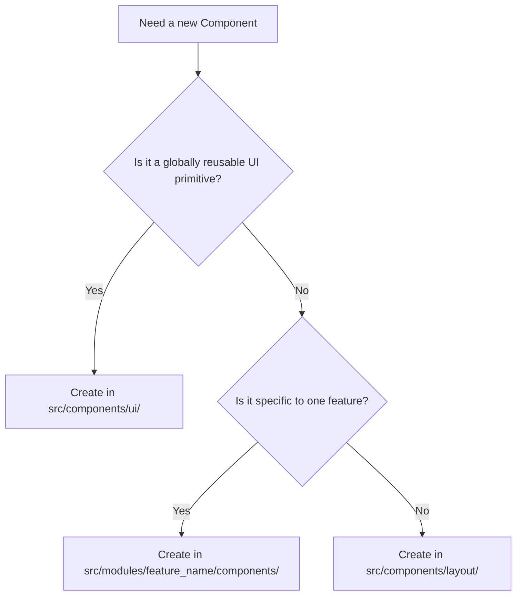

# FocusFlow Codebase Development & Architecture Guide

This document defines the guidelines, folder structures, and processes for creating, redesigning, or modifying components within the FocusFlow application. Follow these conventions to keep the codebase clean, modular, and maintainable.

---

## 📂 Directory Structure Map

```
src/
├── components/          # Shared global components
│   ├── ui/              # Primitive design system components (buttons, input fields, modals)
│   └── layout/          # Layout wrappers (Sidebar, Headers, Zen Layout)
├── modules/             # Core features/modules of FocusFlow
│   ├── <feature_name>/  # Feature directory (e.g., journal, study, habits)
│   │   ├── components/  # Feature-specific subcomponents (under 500 lines)
│   │   ├── utils/       # Feature-specific pure utility functions
│   │   └── <Feature>Module.tsx # Main orchestrator component (mounts the feature)
├── pages/               # Page entry points (e.g. LoginPage.tsx, Dashboard.tsx)
├── store/               # Zustand state management
│   ├── slices/          # Feature slices (todoSlice, journalSlice, etc.)
│   ├── types.ts         # Central types declarations
│   └── useAppStore.ts   # Reconstitutes all slices into a unified hook
└── utils/               # Global utility scripts
```

---

## 🛠️ Modifying or Redesigning Features

Before scanning folders, refer to this mapping table to locate the exact orchestrator file and its components:

| Module / Feature | Folder Location | Main Orchestrator File | Primary Subcomponents | State Slice |
| :--- | :--- | :--- | :--- | :--- |
| **Authentication / Login** | `src/pages/` | [LoginPage.tsx](file:///c:/Users/Rahul/OneDrive/Desktop/PersonalApp/src/pages/LoginPage.tsx) | `LoginForm`, `RegisterForm`, `Alert` | Local state + Supabase |
| **Journal Module** | `src/modules/journal/` | [JournalModule.tsx](file:///c:/Users/Rahul/OneDrive/Desktop/PersonalApp/src/modules/journal/JournalModule.tsx) | `JournalEditor`, `StickyNotes` (List-Style), `JournalSettingsSidebar` | `journalSlice.ts` |
| **To-Do List** | `src/modules/todo/` | [TodoModule.tsx](file:///c:/Users/Rahul/OneDrive/Desktop/PersonalApp/src/modules/todo/TodoModule.tsx) | `TodoSidebar`, [TaskList](file:///c:/Users/Rahul/OneDrive/Desktop/PersonalApp/src/modules/todo/TaskList.tsx) (Task List Core & Mobile Layout) | `todoSlice.ts` |
| **Habit Tracker** | `src/modules/habits/` | [HabitTrackerModule.tsx](file:///c:/Users/Rahul/OneDrive/Desktop/PersonalApp/src/modules/habits/HabitTrackerModule.tsx) | `HabitStats`, `HabitCalendar`, `HabitChecklist`, `HabitCard`, `HabitModal` | `habitSlice.ts` |
| **Condition Worksheet** | `src/modules/condition/` | [ConditionModule.tsx](file:///c:/Users/Rahul/OneDrive/Desktop/PersonalApp/src/modules/condition/ConditionModule.tsx) | `VariablesPanel`, `RulesPanel`, `DecisionDiagram`, `RegexTipsModal` | `conditionSlice.ts` |
| **Budget Ledger** | `src/modules/budget/` | [BudgetModule.tsx](file:///c:/Users/Rahul/OneDrive/Desktop/PersonalApp/src/modules/budget/BudgetModule.tsx) | `BudgetStats`, `BudgetTransactionForm` (Cupertino Modal), `BudgetTransactionList` (Recent Sales Table), `BudgetStatsDonut` (Interactive Donut Stats) | `budgetSlice.ts` |
| **Mind Map Creator** | `src/modules/mindmap/` | [MindmapModule.tsx](file:///c:/Users/Rahul/OneDrive/Desktop/PersonalApp/src/modules/mindmap/MindmapModule.tsx) | `MindmapSidebar`, `MindmapCanvas`, `NodeDetailsPanel`, `MindmapModals` | `mindmapSlice.ts` |
| **Study Tracker** | `src/modules/study/` | [StudyModule.tsx](file:///c:/Users/Rahul/OneDrive/Desktop/PersonalApp/src/modules/study/StudyModule.tsx) | `SubjectCard`, `SubjectDashboard`, `TopicWorkspace`, `StudyTimer`, `FlashcardStudy`, `StudyModals` | `studySlice.ts` |
| **Utilities Module** | `src/modules/utilities/` | [UtilitiesModule.tsx](file:///c:/Users/Rahul/OneDrive/Desktop/PersonalApp/src/modules/utilities/UtilitiesModule.tsx) | `LinksModule` (Link Vault), [LinkSaverModule](file:///c:/Users/Rahul/OneDrive/Desktop/PersonalApp/src/modules/linksaver/LinkSaverModule.tsx) (Link Saver), `CalculatorModule`, `CountdownModule` | `utilitySlice.ts` |

---

## 🏗️ Guidelines: Creating a New Component

Follow this decision tree when creating new components:



### 1. Reusable UI Primitives (`src/components/ui/`)
* **What belongs here**: Core visual inputs, buttons, sliders, tooltips, selection grids, indicators.
* **Rules**: 
  - Ensure maximum flexibility by accepting tailwind class extensions (`className?: string`) and generic props.
  - Implement full accessibility (ARIA, semantic HTML tags, keyboard navigability).
  - Example: `src/components/ui/ProgressBar.tsx` or `src/components/ui/Modal.tsx`.

### 2. Feature-Specific Subcomponents (`src/modules/<feature_name>/components/`)
* **What belongs here**: Composed visual components bound directly to a feature's data structures (e.g. `StickyNoteCard`, `SubjectCard`).
* **Rules**:
  - Limit props depth: pass data items (e.g. `subject={subject}`) and handlers directly.
  - Keep files **under 500 lines of code**. If code exceeds 500 lines, split subcomponents further.
  - Keep styling consistent with the module's layout system.

---

## ⚡ Guidelines: Changing State / Actions

FocusFlow uses a unified Zustand store constructed from feature slices. When adding new state attributes or sync handlers:

1. **Declare the Types**:
   Add new interfaces, state structures, or handler function signatures to [src/store/types.ts](file:///c:/Users/Rahul/OneDrive/Desktop/PersonalApp/src/store/types.ts).
2. **Implement in the Slice**:
   Open the corresponding slice inside `src/store/slices/` (e.g., [src/store/slices/studySlice.ts](file:///c:/Users/Rahul/OneDrive/Desktop/PersonalApp/src/store/slices/studySlice.ts)) and write the implementation.
3. **Consume in Components**:
   Import `useAppStore` in your component, destructure the hook using shallow equality wrapper `useShallow` to prevent unnecessary re-renders:
   ```typescript
   import { useAppStore } from '../../store/useAppStore';
   import { useShallow } from 'zustand/react/shallow';

   const { activeSubject, updateTopic } = useAppStore(
     useShallow((state) => ({
       activeSubject: state.subjects.find(s => s.id === selectedId),
       updateTopic: state.updateTopic,
     }))
   );
   ```

---

## 🚨 Developer Verification Checklist

Before opening a pull request or merging changes, execute the following commands:

- **Type Check Validation**:
  ```powershell
  npx tsc --noEmit
  ```
  Ensure **0 compilation errors** exist.
- **Production Asset Build**:
  ```powershell
  npm run build
  ```
  Verify Vite correctly compiles all code splits, optimizes chunk bundles, and successfully assets copy scripts.
- **Code Linting Check**:
  ```powershell
  npm run lint
  ```
  Validate syntax formatting rules.
