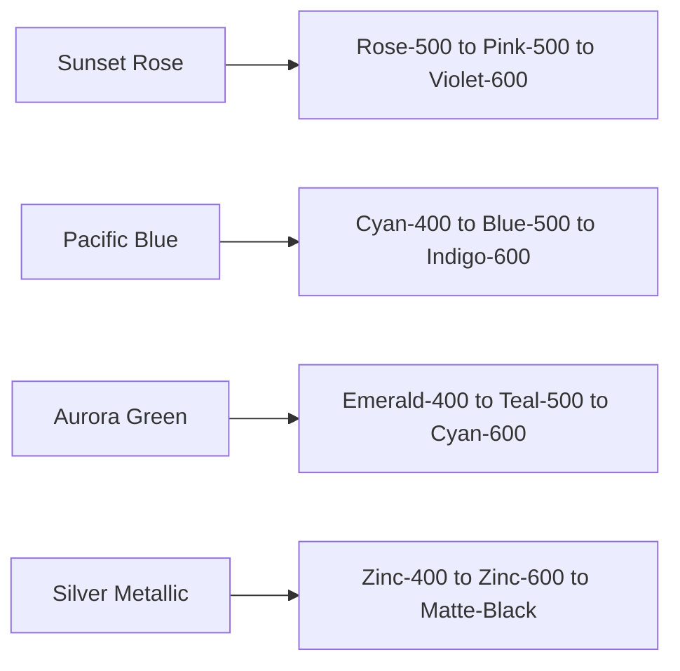

# 🎨 FocusFlow Design System & UX Psychology Manual

This document outlines the visual system, premium Apple-style aesthetic guidelines, micro-interaction guidelines, and core UX psychology principles implemented across the FocusFlow application. 

Use this manual as a standard reference when building, styling, or refactoring components.

---

## 🧠 UX Psychology x Frontend Cheat Sheet (Dimaag ka Hack)

We leverage key psychological principles in our frontend implementation to increase engagement, reduce friction, and make features feel rewarding.

| Principle | Core Logic (Dimaag ka Hack) | Frontend Implementation (React/Tailwind) | Code Pattern Example |
| :--- | :--- | :--- | :--- |
| **1. Smart Defaults** | **Decision fatigue** finish करो. Log choices se darrte hain. Empty fields create friction. | Forms in React (`useState` or React Hook Form) must always contain logical default values. Never leave user inputs completely empty or blank where guessable. | ```tsx<br/>const [task, setTask] = useState({<br/>  priority: 'medium',<br/>  dueDate: new Date().toISOString().split('T')[0]<br/>});<br/>``` |
| **2. Goal Gradient** | **Fake momentum** do! 0% progress is demotivating; starting from 15-20% keeps them going. | Progress bars should never start at `w-0`. Auto-complete step 1 (e.g., "Created account" or "Chose layout") and set initial progress width to `w-1/4` or `w-1/5`. | ```tsx<br/>{/* Start from 20% instead of 0% */}<br/><div className="w-full bg-border rounded-full h-2"><br/>  <div className="bg-primary h-2 rounded-full" style={{ width: '20%' }} /><br/></div><br/>``` |
| **3. Reciprocity** | Pehle **value** fek ke maaro, fir signup/login maango. | Let the user try the interactive tool (e.g., Mindmap or To-Do list) using local Zustand state immediately. When they try to save, export, or sync across devices, trigger a beautiful login dialog. | ```tsx<br/>const handleSave = () => {<br/>  if (!isAuthenticated) {<br/>    openLoginModal();<br/>    return;<br/>  }<br/>  saveToCloud();<br/>};<br/>``` |
| **4. IKEA Effect** | Jis cheez par **mehnat** ki ho, log use chhodte nahi hain. | Allow interactive configurations (like customized colors, sorting, layout selectors, or choosing an avatar) immediately. Store this in `localStorage` so the app feels personalized from the start. | ```tsx<br/>// Save layout configuration to local storage<br/>const saveThemePreference = (theme: string) => {<br/>  localStorage.setItem('focusflow_theme', theme);<br/>  setTheme(theme);<br/>};<br/>``` |
| **5. Loss Aversion** | **Darr > Lalach**. People hate losing things more than they like gaining them. | For "Cancel", "Exit", or "Reset" actions, use warning colors (`bg-red-500/10 text-red-500 border-red-500/20`). Explicitly state exactly what data, unsaved work, or history is going to be permanently lost. | ```tsx<br/>// Clear confirmation with warning of loss<br/>const confirmExit = () => {<br/>  const confirm = window.confirm("Are you sure? You will lose 15 mins of unsaved study logs!");<br/>  if (confirm) exitSession();<br/>};<br/>``` |
| **6. Contrast Effect** | **Enterprise/High value tier** pehle dikhao, baki cheap/sasta lagega. | In pricing blocks or feature comparisons, render the highest-value tier or premium tier first (left-most or top-most). Against that premium benchmark, other plans look extremely affordable. | ```tsx<br/>// Render plans array sorted from expensive to cheap<br/>const plans = [enterprisePlan, professionalPlan, basicPlan];<br/>``` |

---

## 🍎 Apple Design System & UX Principles

FocusFlow mimics Apple’s signature design feel: clean layouts, extreme legibility, high-end materials, and tactile feel.

### 1. Aesthetic Integrity
Aesthetic integrity is not just about being "pretty"—it’s about how well the visual design aligns with the app's functionality:
* **Zen Layouts**: Use large negative space to keep user attention on their work. Avoid cluttered menus or excessive borders.
* **Proportional Typography**: FocusFlow uses `DM Sans` for clean, editorial headings. Headings use negative letter-spacing (`letter-spacing: -0.01em`) to look compact and premium.

### 2. Translucency & Materials (Glassmorphism)
Apple uses translucent overlays (materials) to establish hierarchy and connection with the background.
* **Aura Glass System**:
  Frosted glass cards are implemented using opacity overlays layered with deep blurs:
  ```html
  <div className="bg-surface/40 backdrop-blur-xl border border-border/50 shadow-subtle">
    <!-- Premium Card Content -->
  </div>
  ```
* **Performance Fallback**: If a system has lag or uses the user-defined `reduce-blur` accessibility flag, we dynamically downgrade translucent backdrops to solid theme background colors.

### 3. Tactile Feedback & Micro-Animations
Make actions feel physical. Every click or tap should trigger a subtle response:
* **Bounce / Scale Effects**: All primary buttons must bounce slightly when pressed to give click confirmation:
  ```css
  .btn:active {
    transform: scale(0.97); /* Haptic feel scale down */
    transition: transform 0.1s cubic-bezier(0.25, 0.46, 0.45, 0.94);
  }
  ```
* **Hover Scaling**: Interactive cards must slide or elevate slightly on hover (e.g. `hover:-translate-y-0.5 hover:shadow-lifted`).
* **Transitions**: Use spring-like transitions for drawers, modals, and tabs instead of standard linear movements.

### 4. Apple Focus Rings & Keyboard Accessibility
* Ensure clear outline indicators when navigating via keyboard (`:focus-visible`), but suppress them during mouse clicks (`:focus:not(:focus-visible)`) to keep the visual design clean.

---

## 🎨 Theme Colors & Gradient Palettes

FocusFlow's color design tokens are defined in [src/index.css](file:///c:/Users/Rahul/OneDrive/Desktop/PersonalApp/src/index.css) and registered in [tailwind.config.js](file:///c:/Users/Rahul/OneDrive/Desktop/PersonalApp/tailwind.config.js).

### Global Theme Tokens
* **Background (`var(--bg-background)`)**: Dark mode `#0a0a0a` (Vantablack hybrid) or Light mode `#f4f4f5`.
* **Surface (`var(--bg-surface)`)**: Dark mode `#111111` or Light mode `#ffffff`.
* **Border (`var(--border-border)`)**: Dark mode `#1f1f1f` or Light mode `#e4e4e7`.
* **Primary Accent (`var(--accent-primary)`)**: Apple Rose-Red `#f43f5e`.

### Premium Apple Gradient Catalog
Apply these rich, smooth gradients for metrics, progress statuses, headers, and call-to-actions:



1. **Sunset Rose (Default Focus/Energy)**
   * **Tailwind Classes**: `bg-gradient-to-tr from-rose-500 via-pink-500 to-violet-600`
   * **Feel**: Vibrant, motivational, energetic.

2. **Pacific Blue (Study/Timer/Calm)**
   * **Tailwind Classes**: `bg-gradient-to-tr from-cyan-400 via-blue-500 to-indigo-600`
   * **Feel**: Deep concentration, trust, tranquility.

3. **Aurora Green (Habits/Budget/Success)**
   * **Tailwind Classes**: `bg-gradient-to-tr from-emerald-400 via-teal-500 to-cyan-600`
   * **Feel**: Growth, wealth, completions.

4. **Silver Metallic / Dark Obsidian (Enterprise/Stats)**
   * **Tailwind Classes**: `bg-gradient-to-tr from-zinc-300 via-zinc-500 to-zinc-800 dark:from-zinc-500 dark:via-zinc-700 dark:to-zinc-950`
   * **Feel**: Industrial, sophisticated, premium.

---

## ⚡ UI Design Guidelines for Components

When building any interface:
1. **Never use generic borders**: Prefer shadow elevation and contrast over thick borders. Use `border border-border/50` for outline.
2. **Padding scale**: Always follow the base-4 spacing scale (`px-compact`, `px-sm`, `px-md`, `px-lg`).
3. **Responsive first**: Wrap lists in grid configurations (`grid grid-cols-1 md:grid-cols-2 lg:grid-cols-3`) to handle desktop monitors and mobile devices seamlessly.
4. **Skeleton States**: Always render a `.shimmer-skeleton` state when loading asynchronous data to decrease perceived wait times.
